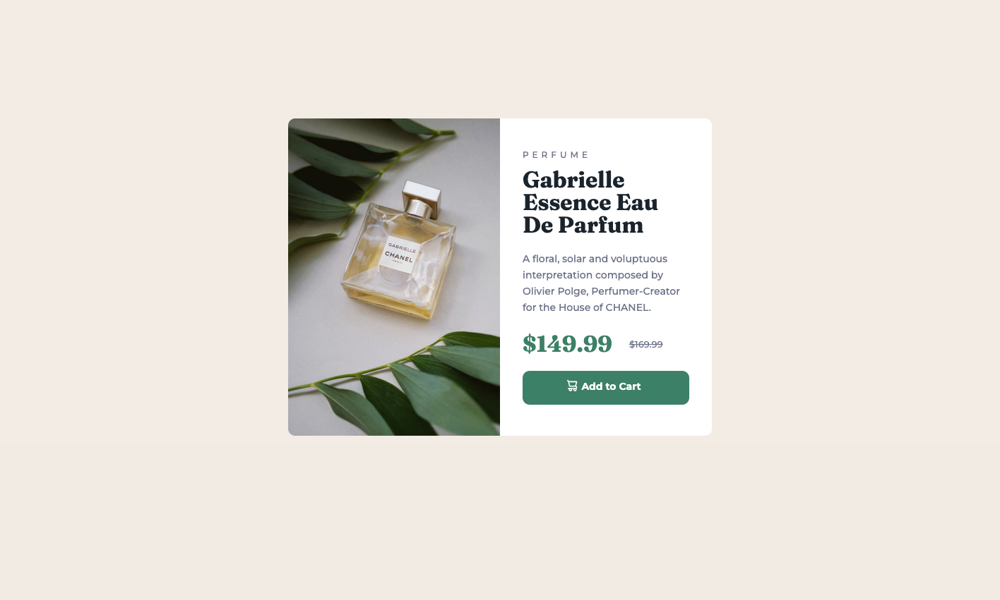
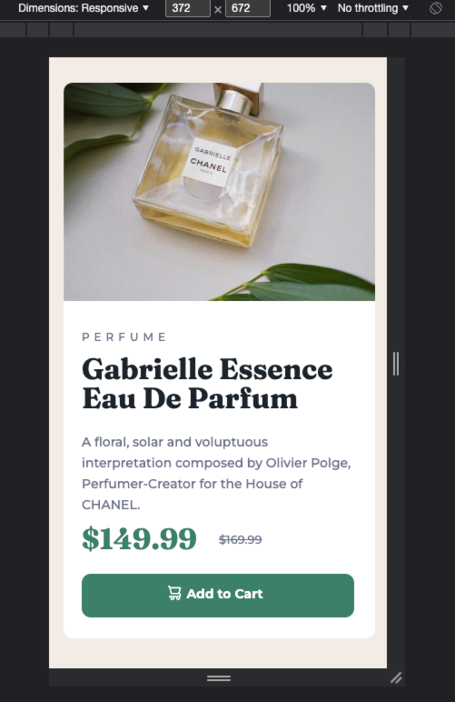

# Frontend Mentor - Product preview card component solution

This is a solution to the [Product preview card component challenge on Frontend Mentor](https://www.frontendmentor.io/challenges/product-preview-card-component-GO7UmttRfa). Frontend Mentor challenges help you improve your coding skills by building realistic projects. 

## Table of contents

- [Overview](#overview)
  - [The challenge](#the-challenge)
  - [Screenshot](#screenshot)
  - [Links](#links)
- [My process](#my-process)
  - [Built with](#built-with)
  - [What I learned](#what-i-learned)
  - [Continued development](#continued-development)
- [Author](#author)

**Note: Delete this note and update the table of contents based on what sections you keep.**

## Overview

### The challenge

Users should be able to:

- View the optimal layout depending on their device's screen size
- See hover and focus states for interactive elements

### Screenshot




### Links

- Solution URL: [https://github.com/jstarr25/Product_preview_card_component](hhttps://github.com/jstarr25/Product_preview_card_component)
- Live Site URL: [https://jstarr25.github.io/Product_preview_card_component](https://jstarr25.github.io/Product_preview_card_component/)

## My process

I first went over the design and decided to start by making the desktop version of the site.
Started by creating the layout of the card to ensure that placement for the image and text were in the right place.
I then started to work on the position of the text and the formatting.
The added the image.
Then created the button with a hover state to complete the desktop version of the card.
For the mobile view I altered the size of the card to fit the specs, I had to change some of my code so that instead of using the same image, it would instead hide the current image and unhide the new image, which was of a different size.
I then re-positioned all of the text to below the image.
I also increased the length of the button.

### Built with

- Semantic HTML5 markup
- CSS custom properties

### What I learned

I learned that hsl colors require a backup in which I used the following:

```css
.button {
  background-color: rgb(60, 128, 103);
  background-color: hsl(158, 36%, 37%);
}
```

I also learned that it is a good trick to alter the display of images to give the impression that an image had been re-sized instead of knowing that it is a different image all together.


### Continued development

I want to focus on refining my skills in HTML and CSS.
I will most likely come back to this to refactor and maybe tidy it up more.

## Author

- Frontend Mentor - [@jstarr25](https://www.frontendmentor.io/profile/jstarr25)
